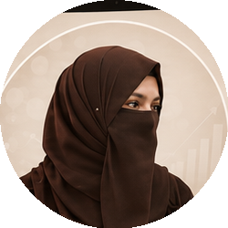

<!DOCTYPE html>
<html lang="en">
<head>
<meta charset="UTF-8">
<meta name="viewport" content="width=device-width, initial-scale=1.0">
<title>AI Automation Learner | Portfolio</title>
<link rel="preconnect" href="https://fonts.googleapis.com">
<link rel="preconnect" href="https://fonts.gstatic.com" crossorigin>
<link href="https://fonts.googleapis.com/css2?family=Dancing+Script:wght@600;700&display=swap" rel="stylesheet">

</head>
<body>

  

    <svg viewBox="0 0 34 34">
      <g class="wing-left">
        <path d="M17 15 C 8 4, -2 6, 3 16 C 6 22, 13 20, 17 15 Z" fill="#D4A24E"/>
        <path d="M17 18 C 10 20, 4 26, 9 30 C 13 32, 17 24, 17 18 Z" fill="#A9744F"/>
      </g>
      <g class="wing-right">
        <path d="M17 15 C 26 4, 36 6, 31 16 C 28 22, 21 20, 17 15 Z" fill="#D4A24E"/>
        <path d="M17 18 C 24 20, 30 26, 25 30 C 21 32, 17 24, 17 18 Z" fill="#A9744F"/>
      </g>
      <ellipse cx="17" cy="17" rx="1.4" ry="9" fill="#3B2415"/>
      <circle cx="17" cy="8" r="1.6" fill="#3B2415"/>
    </svg>
  

  

    <svg viewBox="0 0 34 34">
      <g class="wing-left">
        <path d="M17 15 C 8 4, -2 6, 3 16 C 6 22, 13 20, 17 15 Z" fill="#3E7C7C"/>
        <path d="M17 18 C 10 20, 4 26, 9 30 C 13 32, 17 24, 17 18 Z" fill="#6B4226"/>
      </g>
      <g class="wing-right">
        <path d="M17 15 C 26 4, 36 6, 31 16 C 28 22, 21 20, 17 15 Z" fill="#3E7C7C"/>
        <path d="M17 18 C 24 20, 30 26, 25 30 C 21 32, 17 24, 17 18 Z" fill="#6B4226"/>
      </g>
      <ellipse cx="17" cy="17" rx="1.4" ry="9" fill="#121212"/>
      <circle cx="17" cy="8" r="1.6" fill="#121212"/>
    </svg>
  

  

    <svg viewBox="0 0 34 34">
      <g class="wing-left">
        <path d="M17 15 C 8 4, -2 6, 3 16 C 6 22, 13 20, 17 15 Z" fill="#B5654D"/>
        <path d="M17 18 C 10 20, 4 26, 9 30 C 13 32, 17 24, 17 18 Z" fill="#D4A24E"/>
      </g>
      <g class="wing-right">
        <path d="M17 15 C 26 4, 36 6, 31 16 C 28 22, 21 20, 17 15 Z" fill="#B5654D"/>
        <path d="M17 18 C 24 20, 30 26, 25 30 C 21 32, 17 24, 17 18 Z" fill="#D4A24E"/>
      </g>
      <ellipse cx="17" cy="17" rx="1.4" ry="9" fill="#3B2415"/>
      <circle cx="17" cy="8" r="1.6" fill="#3B2415"/>
    </svg>
  

  

    <svg viewBox="0 0 34 34">
      <g class="wing-left">
        <path d="M17 15 C 8 4, -2 6, 3 16 C 6 22, 13 20, 17 15 Z" fill="#A9744F"/>
        <path d="M17 18 C 10 20, 4 26, 9 30 C 13 32, 17 24, 17 18 Z" fill="#3E7C7C"/>
      </g>
      <g class="wing-right">
        <path d="M17 15 C 26 4, 36 6, 31 16 C 28 22, 21 20, 17 15 Z" fill="#A9744F"/>
        <path d="M17 18 C 24 20, 30 26, 25 30 C 21 32, 17 24, 17 18 Z" fill="#3E7C7C"/>
      </g>
      <ellipse cx="17" cy="17" rx="1.4" ry="9" fill="#121212"/>
      <circle cx="17" cy="8" r="1.6" fill="#121212"/>
    </svg>
  

  

    <svg viewBox="0 0 34 34">
      <g class="wing-left">
        <path d="M17 15 C 8 4, -2 6, 3 16 C 6 22, 13 20, 17 15 Z" fill="#D4A24E"/>
        <path d="M17 18 C 10 20, 4 26, 9 30 C 13 32, 17 24, 17 18 Z" fill="#B5654D"/>
      </g>
      <g class="wing-right">
        <path d="M17 15 C 26 4, 36 6, 31 16 C 28 22, 21 20, 17 15 Z" fill="#D4A24E"/>
        <path d="M17 18 C 24 20, 30 26, 25 30 C 21 32, 17 24, 17 18 Z" fill="#B5654D"/>
      </g>
      <ellipse cx="17" cy="17" rx="1.4" ry="9" fill="#3B2415"/>
      <circle cx="17" cy="8" r="1.6" fill="#3B2415"/>
    </svg>
  

<!-- HERO / ABOUT -->
<section class="hero">
  

    
🤖 AI AUTOMATION LEARNER

    <h1 class="fade-up d1">Hi, I'm building the future with AI &amp; Automation</h1>
    

      A passionate learner exploring AI-powered automation, web development, and smart digital solutions.
      Currently sharpening my skills through hands-on projects, internships, and continuous learning —
      turning ideas into real, working products.
    

  

  

    

      

        

        

        

        

      

      

      

      

        

        

        

      

      

        

          

          

            
            
Samreen Chaudhery

          

        

        

      

      

    

  

</section>

<!-- EXPERIENCE -->
<section>
  <h2 class="section-title fade-up">Experience</h2>
  

    

      <h3>Laravel Developer — Internship</h3>
      
ID Logix Software House

      3 Months · 2025
    

    

      <h3>WordPress Developer — Internship</h3>
      
DigiWeebly

      3 Months · 2026
    

  

</section>

<!-- EDUCATION -->
<section>
  <h2 class="section-title fade-up">Education</h2>
  

    <h3>Bachelor of Science in Information Technology (BSIT)</h3>
    
University of Sahiwal

    
Currently in 6th Semester

    CGPA: 3.79 / 4.00
  

</section>

<!-- SKILLS -->
<section>
  

    

      <h2 class="section-title fade-up">Technical Skills</h2>
      

        WordPress
        Elementor
        HTML5
        CSS3
        PHP
        Laravel
        MySQL
        Responsive Design
        Git &amp; GitHub
      

    

    

      <h2 class="section-title fade-up">MS Office</h2>
      

        MS Word
        MS Excel
        MS PowerPoint
      

    

  

</section>

<!-- PROFESSIONAL SKILLS -->
<section>
  <h2 class="section-title fade-up">Professional Skills</h2>
  

    Communication Skills
    Client Handling
    Customer Relationship Management
    Problem Solving
    Time Management
    Team Collaboration
    Reporting &amp; Documentation
    Quick Learning
    Presentation Skills
  

</section>

<!-- LANGUAGES -->
<section>
  <h2 class="section-title fade-up">Languages</h2>
  

    

      
EnglishFluent

      

    

    

      
UrduNative

      

    

  

</section>

<footer>
  Made with ❤️ — Always Learning, Always Building
</footer>

</body>
</html>
